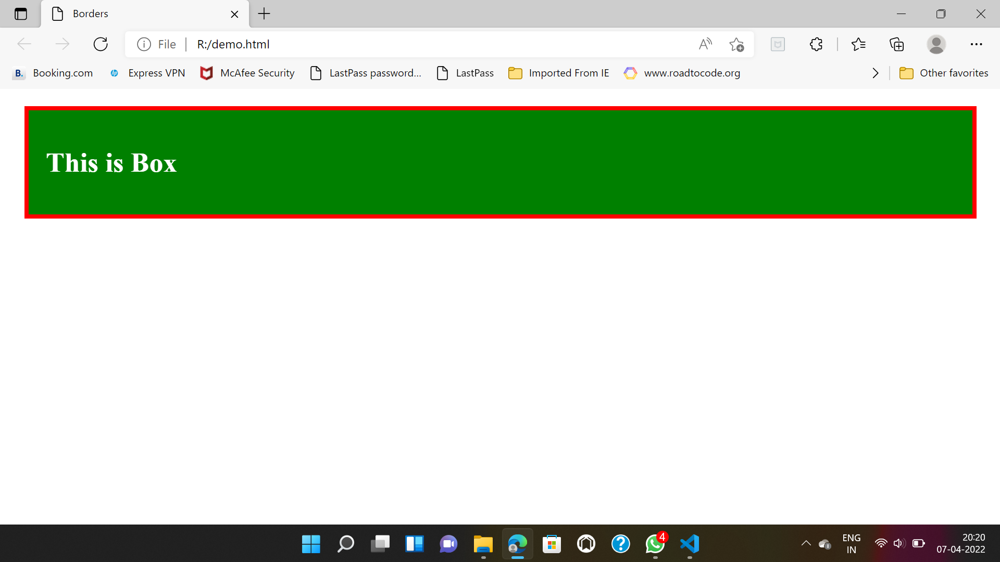

## Lecture-11 CSS Borders

## Borders :

**Types Of Borders :**

1. None
2. Dotted (`.......`)
3. Solid (`_________`)
4. Dashed (`--------`)
5. Double (`=========`)

## Three Parameters of Border Design 

* `border-color`
* `border-style`
* `border-width`

**💻 Example :**

```html
<!DOCTYPE html>
<html lang="en">
<head>
<title>Borders</title>
<style>
.box{
border-style: solid;
border-width: 5px; border-color: #FF0000;
background-color: green;
padding: 20px;
margin: 20px;
color: white;
}
</style>
</head>
<body>
<div class="box">
<h1>This is Box</h1>
</div>
 </body>
 </html>
```




## 🏠 Homework 

>1️⃣ Create 10 Types of different buttons using border and border-radius properties.

>2️⃣ Create sing-up form using all the css properties you have learn.